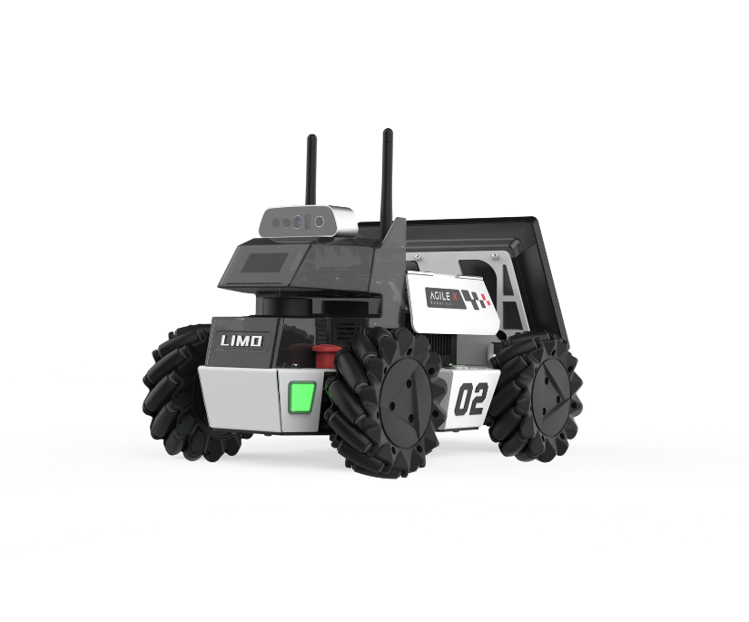
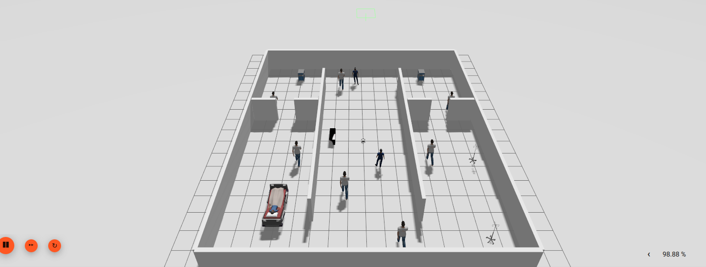
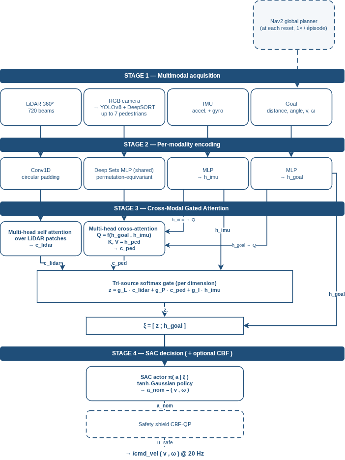
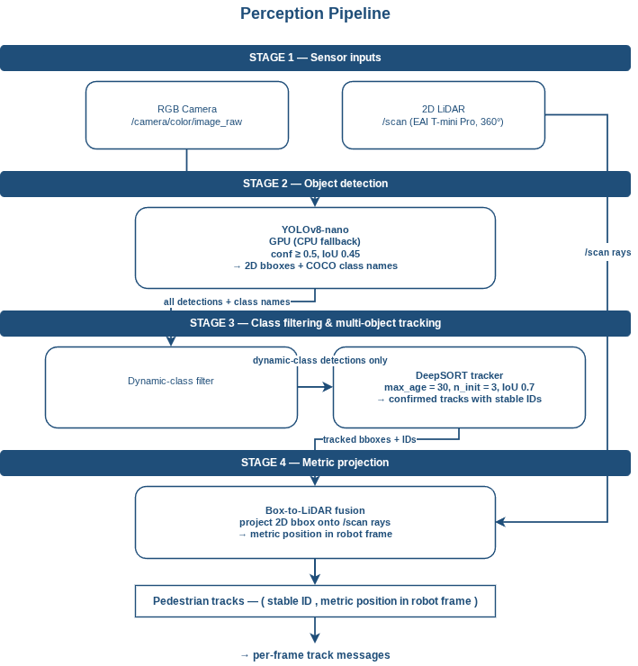

# CM-GAP-SAC

**Cross-Modal Gated-Attention Prioritized Soft Actor-Critic**

A safe multi-modal deep reinforcement learning policy for social navigation in dynamic indoor environments, deployed on the AgileX LIMO Pro.

<p align="center">
  
  <br/>
  <em>The AgileX LIMO Pro platform</em>
</p>

<p align="center">
  
  <br/>
  <em>The simulated hospital environment in Gazebo Harmonic</em>
</p>


---

## Overview

Mobile robots operating in indoor spaces shared with people have to move safely among pedestrians who walk, stop, and change direction without warning. Reinforcement learning policies that learn to navigate rarely come with any guarantee that they will not collide.

CM-GAP-SAC is a local navigation policy trained with Soft Actor-Critic that fuses LiDAR, tracked pedestrians, inertial data and the goal through a gated cross-attention mechanism, and enforces hard safety through a Control Barrier Function shield solved as a quadratic program. It runs on ROS 2 Jazzy and is trained in a Gazebo simulation of a hospital-like world with dynamic pedestrian agents.

This repository contains the implementation of my engineering and Master's thesis, *Intelligent Perception and Navigation for Mobile Robots in Dynamic Environments*, defended at ESTIN (Béjaïa, Algeria) under the supervision of Dr. Ali Djenadi.

## Contributions

**1. Tri-source gated-softmax fusion with an IMU-augmented attention query.**
The policy fuses three sensing sources (LiDAR, tracked pedestrians, inertial data) together with the goal. A per-dimension gated softmax weighs the three contexts, and the cross-attention query over pedestrians is built from the concatenation of the goal and IMU latents, so social attention adapts to the robot's own physical state. This extends the LiDAR-only gated attention of GAP_SAC to a genuinely multi-modal state.

**2. Attention-entropy prioritized replay.**
Each stored transition is prioritized by a signed TD error scaled by a factor derived from the entropy of the pedestrian attention distribution. When the attention concentrates on a single pedestrian, the moment is treated as a critical decision and replayed more often. Clipping the TD error at zero keeps terminal collisions from dominating the buffer and pushing the critic toward pessimism. Setting the attention weight to zero reduces the scheme to standard PER.

**3. Control Barrier Function safety shield.**
A CBF-QP layer solved with OSQP filters the commanded linear velocity at every control step, projecting an unsafe action onto the closest safe one and keeping the robot inside a forward-invariant safe set. Safety radii are set per obstacle class (0.25 m static, 0.40 m pedestrians in training, 0.60 m on the real robot). The QP was feasible on every step of the full evaluation campaign.

## Architecture

<p align="center">
  
</p>

At each reset, Nav2 computes a single global plan for the current goal and caches it for the whole episode. At each control step the multi-modal observation is built, encoded per modality, fused through the gated attention module and passed to the actor. The actor proposes a velocity command, which the safety shield may adjust before it reaches the wheel. The goal entry of the observation points to the current waypoint, while the success condition is measured against the final goal.

### Observation space

| Modality | Shape | Content |
|---|---|---|
| `lidar` | (360,) | 720 beams downsampled to 360, clipped to [0.05, 6.0] m, 360° field of view |
| `pedestrians` | (k_max, 5) | relative position, relative velocity, normalized track age |
| `ped_mask` | (k_max,) | 1 for a real slot, 0 for padding |
| `imu` | (6,) | linear acceleration and angular velocity, normalized to [-1, 1] |
| `goal` | (4,) | distance, bearing, own linear and angular velocity |

Each modality is encoded by a network matched to its structure: a 1D CNN with circular padding for the periodic LiDAR scan, a shared per-element MLP (Deep Sets) for the unordered pedestrian set, and small MLPs for the IMU and goal vectors.

**Action space**: continuous, `v` in [-0.3, 0.5] m/s and `omega` in [-1.0, 1.0] rad/s, at 20 Hz.

### Perception front-end

<p align="center">
  
</p>

YOLOv8-nano detects objects on the camera stream, a dynamic-class filter keeps only moving categories, DeepSORT assigns stable identities across frames, and a box-to-LiDAR fusion projects each track to a metric position in the robot frame. This design works without a depth camera, a transform tree, or intrinsic calibration.

During training in simulation, pedestrian tracks are read from Gazebo ground truth, so the policy learns from a clean input and the training signal reflects the policy rather than the noise of a perception stack. Whatever the source, the policy always receives the same five features per pedestrian.

## Results

Evaluated over 500 episodes per (method, scenario) pair, on the same spawn-goal seeds across all methods so that pose variance is removed from the comparison. Success rate in percent, Wilson 95% confidence intervals in brackets.

| Scenario | CM-GAP-SAC | Nav2 + DWB | SAC (ablation) |
|---|---|---|---|
| S1 static only | 83.2 [79.7, 86.2] | **94.0** [91.6, 95.8] | 7.6 [5.6, 10.3] |
| S2 3 peds @ 0.3 m/s | 79.6 [75.8, 82.9] | **87.0** [83.8, 89.7] | 5.2 [3.6, 7.5] |
| S4 5 peds @ 0.3 m/s | **77.8** [74.0, 81.2] | 77.2 [73.3, 80.7] | 4.8 [3.2, 7.0] |
| S6 7 peds @ 0.3 m/s | **79.4** [75.6, 82.7] | 72.0 [67.9, 75.8] | 4.6 [3.1, 6.8] |
| S7 7 peds @ 0.5 m/s | **73.3** [69.3, 77.0] | 69.6 [65.4, 73.5] | 4.2 [2.8, 6.3] |

Three findings:

- **Graceful degradation under density.** From 3 to 7 pedestrians, CM-GAP-SAC stays flat (79.6 to 79.4) while Nav2 loses fifteen points. The classical planner's advantage lives in exact static geometry and does not grow with scenario difficulty; the learned policy's advantage lives in dynamic and social behavior and does grow. The crossover sits between S4 and S6, which marks the density at which anticipating pedestrian motion starts to matter more than exact geometric planning.
- **Asymmetric safety profile.** Across the four dynamic scenarios, CM-GAP-SAC averages 2.65% pedestrian collisions against 8.6% for Nav2, up to 6.6x fewer on S4. Nav2 treats a pedestrian as frozen at their last detected position; CM-GAP-SAC uses per-pedestrian velocities to steer around them early. It also holds a larger pedestrian clearance, around 2.2 m against 1.7 to 2.0 m.
- **The three contributions matter jointly.** Removing the fusion, the attention-weighted replay and the shield at the same 1.15M-step training budget drops the success rate by a factor of eleven to eighteen.

The safety shield intervenes on roughly 86% of steps in dynamic scenarios but with a mean correction magnitude of 0.03, small relative to the action bounds. The policy and the shield co-operate: the shield is active often, and its corrections are small. The QP was never infeasible across the whole campaign, so the emergency-stop fallback was never triggered.

The main remaining failure mode is doorway passages under fast pedestrian traffic. Intra-zone success stays between 85% and 91% across all scenarios, while cross-zone success, which requires crossing at least one 1.2 m doorway, drops sharply. Doorways are narrow bottlenecks where the robot must commit to a single trajectory, and a moving pedestrian can block the opening at the wrong moment.

## Stack

- **ROS 2 Jazzy Jalisco** for the middleware, with **Nav2** (NavFn / Dijkstra) as the global planner
- **Gazebo Harmonic** for the simulated hospital environment (16 m x 16 m, one corridor and four rooms)
- **PyTorch** for the encoders, the attention fusion and the SAC actor-critic
- **OSQP** for the CBF quadratic program
- **YOLOv8-nano** and **DeepSORT** for the pedestrian perception front-end
- **RViz2** for visualization
- Target hardware: **AgileX LIMO Pro** with an **NVIDIA Jetson Orin Nano**

## Getting started

### Prerequisites

- Ubuntu 24.04
- ROS 2 Jazzy
- Gazebo Harmonic
- Python 3.12, PyTorch with CUDA recommended

The `limo_description` meshes are the AgileX vendor package and are not tracked in this repository. Clone them from the official AgileX LIMO ROS 2 repository into `src/limo_description/meshes/`.

Training checkpoints and TensorBoard logs are not tracked either, since the final checkpoint is several gigabytes. Available on request.

### Setup

```bash
git clone https://github.com/seryneamrani/CM-GAP-SAC.git
cd CM-GAP-SAC
pip install -r requirements.txt
colcon build --symlink-install
source install/setup.bash
```

### Launch the ROS 2 bridges

Nav2 must be running before training, since the environment queries its planner at each reset.

```bash
./run_bridges.sh
```

### Train

```bash
python src/cm_gap_sac_navigation/cm_gap_sac_navigation/training/train.py
```

### Evaluate

```bash
python src/cm-gap-sac-eval/run_eval.py
```

Evaluation scenarios are defined in `src/cm-gap-sac-eval/configs/pedestrian_scenarios/`, and the result tables are built offline by `src/cm-gap-sac-eval/analysis/build_tables.py`.

## Repository structure

```
CM-GAP-SAC/
├── src/
│   ├── cm_gap_sac_navigation/    # policy, encoders, attention, SAC, PER, safety shield
│   ├── cm-gap-sac-eval/          # evaluation runner, scenarios, metrics, tables
│   ├── limo_perception/          # YOLOv8 + DeepSORT + box-to-LiDAR fusion nodes
│   ├── limo_description/         # robot model, worlds, Nav2 and RViz configs
│   ├── limo_evaluation/          # ROS 2 evaluation nodes
│   └── pedestrian_manager/       # Gazebo pedestrian motion plugin and configs
├── assets/                       # figures used in this README
├── run_bridges.sh
└── requirements.txt
```

## Citation

```bibtex
@mastersthesis{amrani2026cmgapsac,
  author  = {Amrani, Seryne Fettouma},
  title   = {Intelligent Perception and Navigation for Mobile Robots
             in Dynamic Environments},
  type    = {Engineer's degree dissertation in Computer Science,
             specialty Artificial Intelligence and Data Science},
  school  = {École supérieure en Sciences et Technologies de l'Informatique
             et du Numérique (ESTIN)},
  year    = {2026},
  address = {Béjaïa, Algeria},
  note    = {Supervised by Dr. Ali Djenadi}
}
```

## Acknowledgments

Thesis supervised by Dr. Ali Djenadi at ESTIN. This work builds on the gated-attention SAC design of Zhang et al. (2025), which it extends to a multi-modal state with a hard safety layer.

## Contact

**Seryne Fettouma Amrani**
[amrani.seryne@gmail.com](mailto:amrani.seryne@gmail.com)